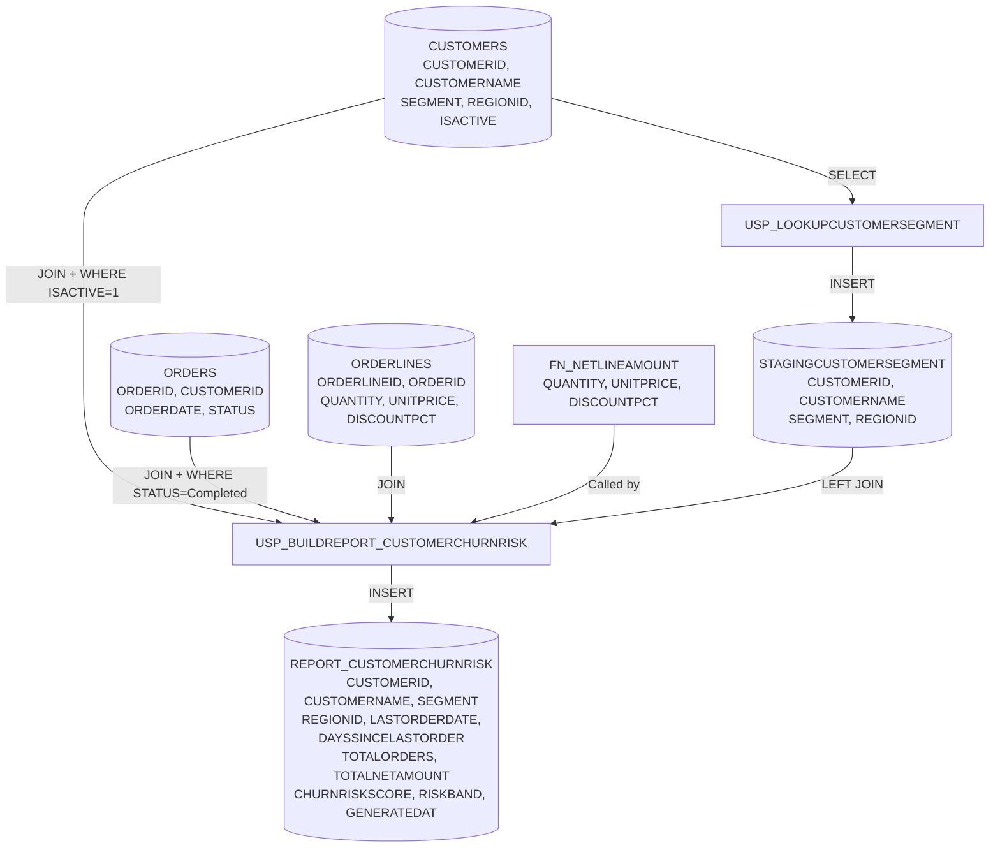

## Lineage Summary for `RETAILDEMO.REPORT_CUSTOMERCHURNRISK`

### Overview

`REPORT_CUSTOMERCHURNRISK` is a report table populated by the stored procedure `USP_BUILDREPORT_CUSTOMERCHURNRISK`. The
report derives customer churn risk scores based on RFM (Recency, Frequency, Monetary) analysis combined with customer
segment data.

### Data Flow

**Primary Sources:**

1. **RETAILDEMO.CUSTOMERS** – Base customer master data (CUSTOMERID, CUSTOMERNAME, SEGMENT, REGIONID, ISACTIVE)
2. **RETAILDEMO.STAGINGCUSTOMERSEGMENT** – Staging table populated nightly by `USP_LOOKUPCUSTOMERSEGMENT`
3. **RETAILDEMO.ORDERS** – Order transactions (filtered to Status = 'Completed', ISACTIVE customers only)
4. **RETAILDEMO.ORDERLINES** – Order line details with pricing (QUANTITY, UNITPRICE, DISCOUNTPCT)

### Key Processing Steps

The report is built through a multi-stage CTE pipeline in `USP_BUILDREPORT_CUSTOMERCHURNRISK`:

1. **active_customer_orders CTE** – Joins CUSTOMERS → ORDERS → ORDERLINES, filtered to:
   - Only active customers (ISACTIVE = 1)
   - Only completed orders (STATUS = 'Completed')
   - Calculates net line amounts via `FN_NETLINEAMOUNT(QUANTITY, UNITPRICE, DISCOUNTPCT)`

2. **rfm CTE** – Aggregates per customer:
   - `LASTORDERDATE` = MAX(ORDERDATE)
   - `TOTALORDERS` = COUNT(DISTINCT ORDERID)
   - `TOTALNETAMOUNT` = SUM(NETAMOUNT)

3. **enriched CTE** – LEFT JOINs STAGINGCUSTOMERSEGMENT to RFM, adding:
   - Customer segment attributes (SEGMENT, REGIONID, CUSTOMERNAME)
   - `DAYSSINCELASTORDER` = TRUNC(SYSDATE) - TRUNC(LASTORDERDATE)
   - Only includes customers that exist in CUSTOMERS with ISACTIVE = 1

4. **scored CTE** – Calculates churn risk score using weighted formula:
   - **Recency component (60%):** Based on days since last order
     - NULL or >365 days → 100
     - > 180 days → 70
     - > 90 days → 40
     - ≤90 days → 10
   - **Frequency component (40%):** Based on total orders
     - 0 orders → 100
     - ≤2 orders → 60
     - ≤5 orders → 30
     - > 5 orders → 5

5. **Final SELECT** – Populates the report table with:
   - `CHURNRISKSCORE` = ROUND(weighted score, 2)
   - `RISKBAND` = 'High' (≥70) | 'Medium' (40-69) | 'Low' (<40)
   - `GENERATEDAT` = SYSTIMESTAMP

### Important Notes

⚠️ **Low-Confidence Lineage:** The column-level lineage edges all carry **"low" confidence** (plsql_static_analysis),
indicating that while the static parser identified the relationships, complex multi-stage CTE logic may not be fully
captured in the transform expressions. The actual logic is best understood by reviewing the full procedure source code
above.

⚠️ **External Dependency:** `STAGINGCUSTOMERSEGMENT.CUSTOMERID` has a **manual override** note indicating it is
"populated by an external nightly load job, not visible in the DB," meaning some data may originate outside the visible
schema.

---

## Mermaid Diagram

This diagram shows the complete data lineage from base tables through staging and transformation to the final churn risk
report table.
