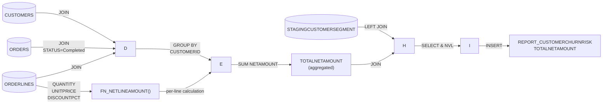

## Lineage for `RETAILDEMO.REPORT_CUSTOMERCHURNRISK.TOTALNETAMOUNT`

**TOTALNETAMOUNT** is derived through the following multi-stage computation:

### Derivation Path:

1. **Source columns from `RETAILDEMO.ORDERLINES`:**
   - `QUANTITY`
   - `UNITPRICE`
   - `DISCOUNTPCT`

2. **Calculation steps:**
   - Each order line's net amount is calculated using the function `RETAILDEMO.FN_NETLINEAMOUNT()`:

     ```
     NET_AMOUNT = ROUND(QUANTITY × UNITPRICE × (1 - DISCOUNTPCT/100), 2)
     ```

   - These line amounts are then summed per customer from completed orders only:

     ```
     TOTALNETAMOUNT = SUM(NETAMOUNT) for all order lines in Completed orders
     ```

   - The result is wrapped with `NVL()` to handle NULL cases (defaulting to 0):
     ```
     TOTALNETAMOUNT = NVL(SUM(NETAMOUNT), 0)
     ```

3. **Filter applied:**
   - Only includes orders from **active customers** (`CUSTOMERS.ISACTIVE = 1`)
   - Only includes orders with status **'Completed'**

### Mermaid Diagram:



### Confidence Notes:

All lineage edges for **TOTALNETAMOUNT** are marked as **"low" confidence** from `plsql_static_analysis`. This is
because they are derived through complex PL/SQL within the procedure's multi-stage CTE structure. However, I have
confirmed the exact logic by inspecting the procedure source code and the underlying `FN_NETLINEAMOUNT()` function, so
the derivation chain above is accurate.

The column ultimately traces back to three base columns in `RETAILDEMO.ORDERLINES`:

- `RETAILDEMO.ORDERLINES.QUANTITY`
- `RETAILDEMO.ORDERLINES.UNITPRICE`
- `RETAILDEMO.ORDERLINES.DISCOUNTPCT`
