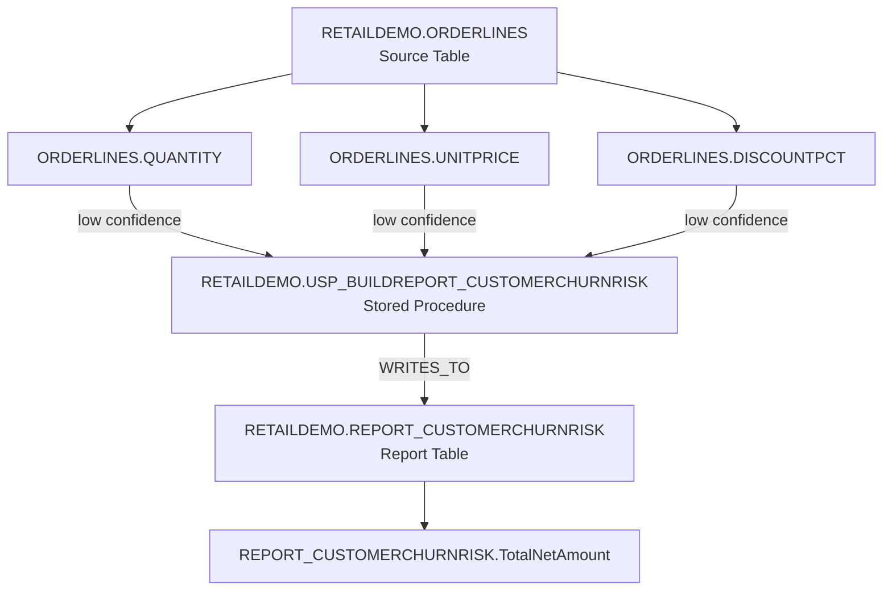

## Lineage of `RETAILDEMO.REPORT_CUSTOMERCHURNRISK.TotalNetAmount`

### Data Derivation Path

**TotalNetAmount** in the report is derived from three source columns in the `RETAILDEMO.ORDERLINES` table:

1. **RETAILDEMO.ORDERLINES.QUANTITY**
2. **RETAILDEMO.ORDERLINES.UNITPRICE**
3. **RETAILDEMO.ORDERLINES.DISCOUNTPCT**

These columns are combined through the stored procedure **RETAILDEMO.USP_BUILDREPORT_CUSTOMERCHURNRISK**, which
calculates the total net amount (likely as: `SUM(QUANTITY * UNITPRICE * (1 - DISCOUNTPCT))`).

### Source Tables

The complete upstream lineage traces to:

- **RETAILDEMO.ORDERLINES** — the primary source table containing transaction line-item data

### Important Notes on Confidence

⚠️ **Low Confidence Lineage**: All three edges from `ORDERLINES` columns to `TotalNetAmount` were detected with **low
confidence** using **plsql_static_analysis**. This is because the actual SQL/PL-SQL logic in the stored procedure
`USP_BUILDREPORT_CUSTOMERCHURNRISK` could not be fully resolved statically. The procedure likely contains dynamic SQL or
complex calculations that the parser could not fully trace. The actual calculation formula and any intermediate
transformations cannot be confirmed from static analysis alone.

### Mermaid Diagram

### Summary

| Component          | Details                                                                                          |
| ------------------ | ------------------------------------------------------------------------------------------------ |
| **Report Column**  | RETAILDEMO.REPORT_CUSTOMERCHURNRISK.TotalNetAmount                                               |
| **Source Columns** | RETAILDEMO.ORDERLINES.QUANTITY, UNITPRICE, DISCOUNTPCT                                           |
| **Transformation** | Via RETAILDEMO.USP_BUILDREPORT_CUSTOMERCHURNRISK (calculation formula not statically resolvable) |

|
| **Confidence Level** | Low (PL/SQL static analysis) |
